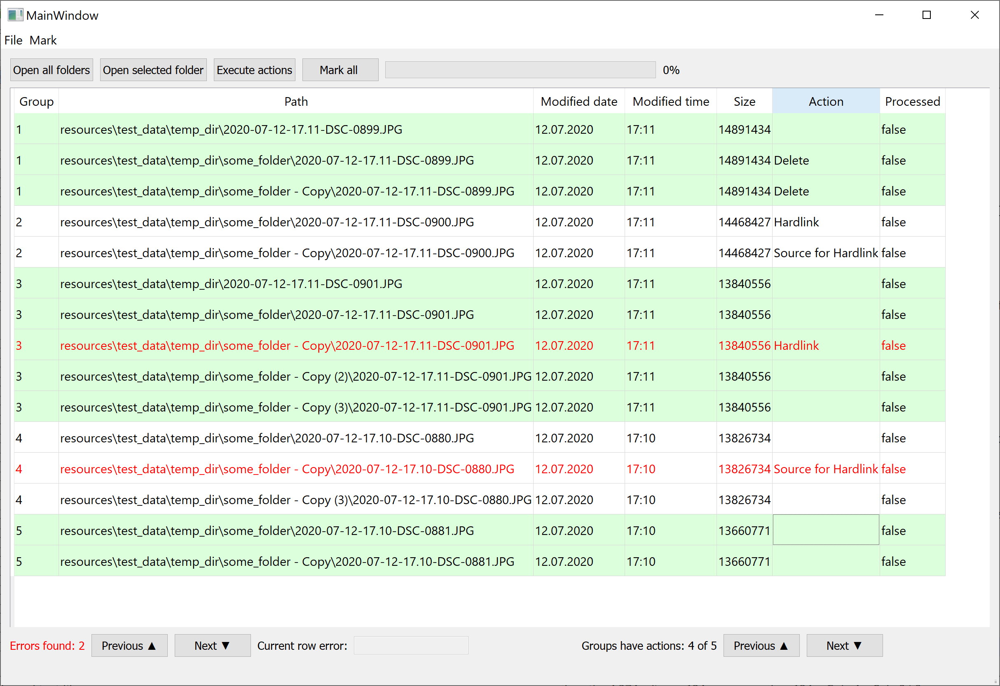

# Warning: The project is in development status. Using it may cause data loss.

## Yes, this is another duplicate files manager

... but with group operations, quick actions assignment with hotkeys and support of hard links.  
No, it can't search for duplicates (yet?). :)

- [Background](#background)
- [Features implemented](#key-features-implemented)
- [Features in process of implementation](#features-i-want-to-implement-in-the-nearest-future)
- [Features to be implemented in future](#features-to-implement-even-later)
- [Want to contribute?](#want-to-contribute)

## Background
I was unhappy with the way duplicate managers usually handle the process of viewing duplicates list and applying actions on them.
Most of such apps focus on the duplicates detection but not on how user decides what he wants to do with those duplicates later. It is especially painful to try to manage thousands of duplicate files.
So I decided to try make my own "perfect" tool for that purpose.

 Here's how it looks like so far:
 



## Key features implemented:
* Ability to open and parse CloneSpy duplicates list file to create a table representation of duplicates
* Actions assignment using hotkeys: "Delete" (D), "Hardlink" (H), "Source for Hardlink" (S) (because every hardlink needs a source, right?)
* Action assignment for all siblings of the file (duplicates lying in the same folder) with one button click
* [Custom rules validation and errors highlight with navigation (Previous/Next error)](#about-rules-validation:)
* [Auto-completion of actions](#about-automatic-completion-of-actions:)
* Actions execution (actual deletion of files to recycle bin and creation of hardlinks)
* Count of groups of duplicates which have no actions assigned yet (aka "how much more groups I have to check?")
* UI tests
* Open location of selected file or location of all files in selected group 

## Features I want to implement in the nearest future:
* Progress bar for files processing (need to put files processing into separate thread)
* Validation of possibility to create Hard links (e.g. files are on the same partition, on NTFS filesystem, etc...)
* Refactor current code, make better structuring of classes and methods
* More UI tests :)

## Features to implement even later:
* Duplicates search
* Undo/Redo last actions
* Session management (save/load current state if program)
* Validation if files loaded from report actually exist
* Linux/MacOS support
* ... and more

## Want to contribute?
This project is open to contributions.
However, so far it doesn't have any proper instruction because I'm the only contributor. 

I guess, you could start from following steps:
1. Download this project to your device (fork it first if you're planning to make Pull Requests)
2. Use command `pip install -r requirements.txt` to install dependencies used by this project
3. Run main.py to see if the app starts

In case of problems or questions regarding work of this app or contribution, you can create Issue or ping me at discord: dupeman#3804

## Some more info:

#### About rules validation:
_to add later_

#### About automatic completion of actions:
Simple rule applied: if there are only two file with no assigned action left in the duplicates group, and user assigns to one of them "Hardlink" action, then the other file will automatically get "Source for hardlink" action. And vice-versa.  

<!--
## All info below is just a draft, don't try to find anything useful there.

## Getting Started

todo

### Prerequisites

todo

```
Give examples
```

### Installing

todo

## Running the tests

todo

### Break down into end to end tests

todo
```
Give an example
```

### And coding style tests

todo
```
Give an example
```

## Deployment

todo

## Built With
todo
* [Dropwizard](http://www.dropwizard.io/1.0.2/docs/) - The web framework used
* [Maven](https://maven.apache.org/) - Dependency Management
* [ROME](https://rometools.github.io/rome/) - Used to generate RSS Feeds

## Contributing

Please read [CONTRIBUTING.md](https://gist.github.com/PurpleBooth/b24679402957c63ec426) for details on our code of conduct, and the process for submitting pull requests to us.

## Versioning

We use [SemVer](http://semver.org/) for versioning. For the versions available, see the [tags on this repository](https://github.com/your/project/tags).

## Authors

* **Billie Thompson** - *Initial work* - [PurpleBooth](https://github.com/PurpleBooth)

See also the list of [contributors](https://github.com/your/project/contributors) who participated in this project.

## License

This project is licensed under the MIT License - see the [LICENSE.md](LICENSE.md) file for details

## Acknowledgements

* Hat tip to anyone whose code was used
* Inspiration
* etc
-->